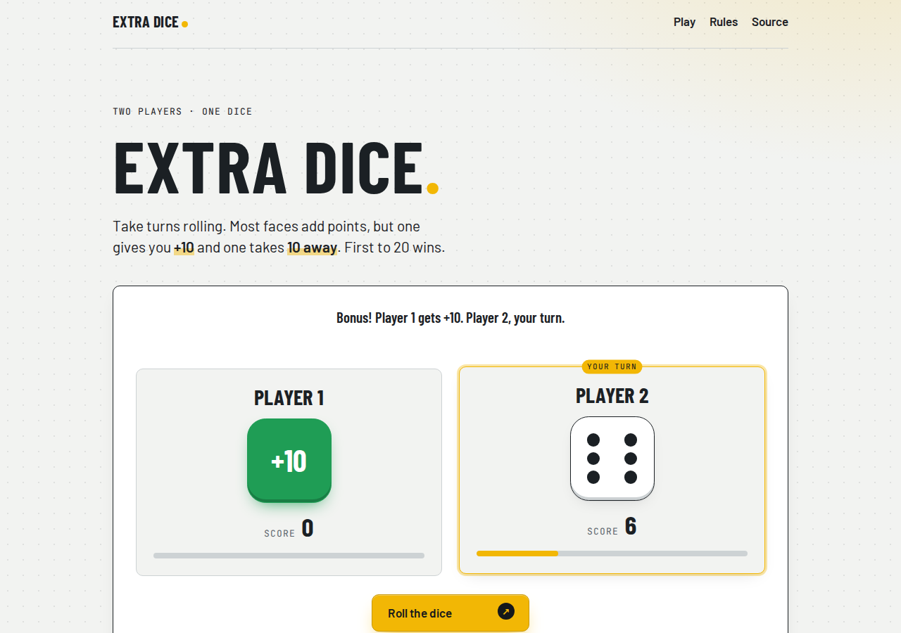

# Extra Dice

> A two-player dice game with a twist: one face gives you +10, another takes 10 away. First to 20 wins.

**[🔗 Live demo](https://brutall100.github.io/scrimba-extra-dice-game/)** · [Code](https://github.com/brutall100/scrimba-extra-dice-game)



## About

This started as the dice game from Scrimba's JavaScript lessons: two players take turns rolling, and the first to reach a target score wins.
I made it my own by giving the dice two "extra" faces, **+10** and **−10**, so one lucky or unlucky roll can flip the whole game.

## Features

- **Random first player**: the game picks who starts
- **Extra faces**: the dice has 3, 4, 5, 6, **+10** and **−10**, each equally likely
- **Live scoreboard** with a progress bar towards 20 points
- **Clear turns**: the active player is highlighted, the winner gets a "Winner" badge
- **Light and dark mode** that follows your system setting
- **Responsive** from phones to wide screens
- **Accessible**: keyboard focus styles, skip link, results read out by screen readers, respects reduced motion

## Built with

- HTML5
- CSS3 (custom properties, grid, flexbox, `color-mix()`)
- Vanilla JavaScript (no frameworks, no build step)

## What I learned

- Keeping the game in a few **state variables** (`scores`, `current`, `winner`) and redrawing the page from them in one `render()` function
- Describing the dice as **data** (a `FACES` list) instead of a long chain of `if` / `else`
- Why `&&` and `&` are not the same thing in JavaScript
- Drawing dice dots with **CSS grid** areas
- Showing and hiding buttons with the `hidden` attribute

## Run it locally

No install needed, it is plain HTML, CSS and JS.

```bash
git clone https://github.com/brutall100/scrimba-extra-dice-game.git
cd scrimba-extra-dice-game
```

Then open `index.html` in your browser.

## Project structure

```
.
├── index.html      # page and game board
├── styles.css      # design tokens, layout, light/dark themes, dice
├── index.js        # game rules and state
└── docs/           # screenshot for this README
```

## Credits

- Course: [Scrimba Frontend Developer Career Path](https://scrimba.com/learn/frontend)
- Fonts: [Google Fonts](https://fonts.google.com/): Barlow, Barlow Condensed and JetBrains Mono
